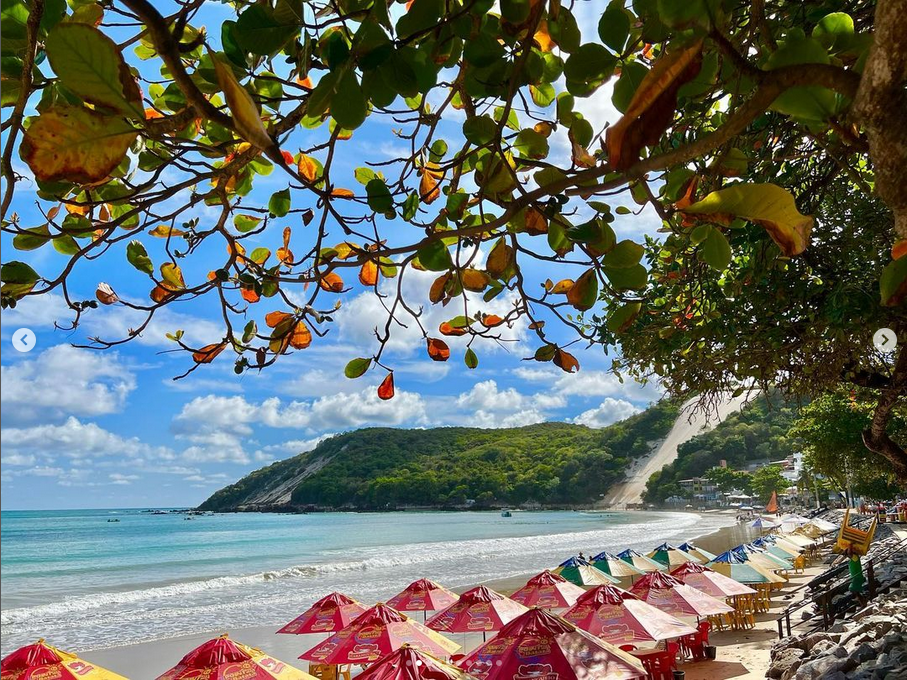
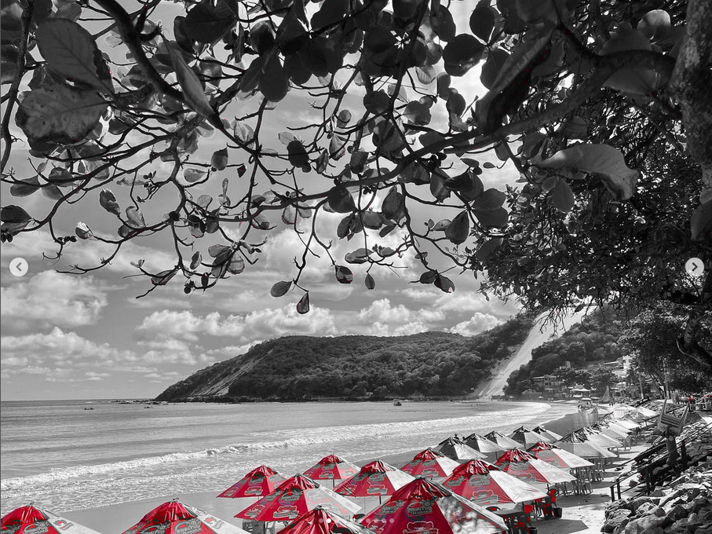
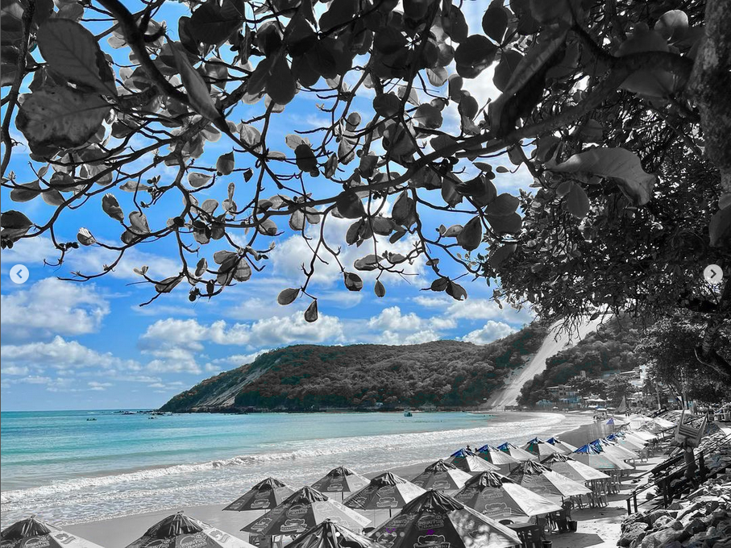
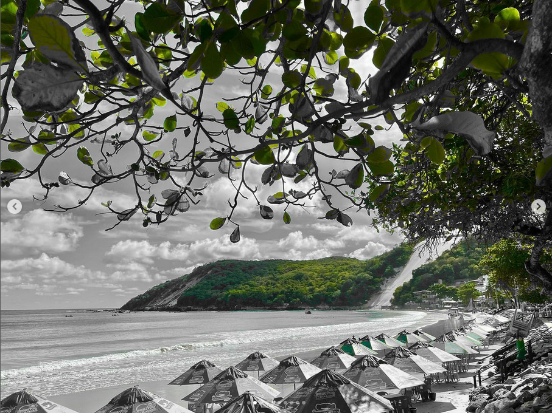
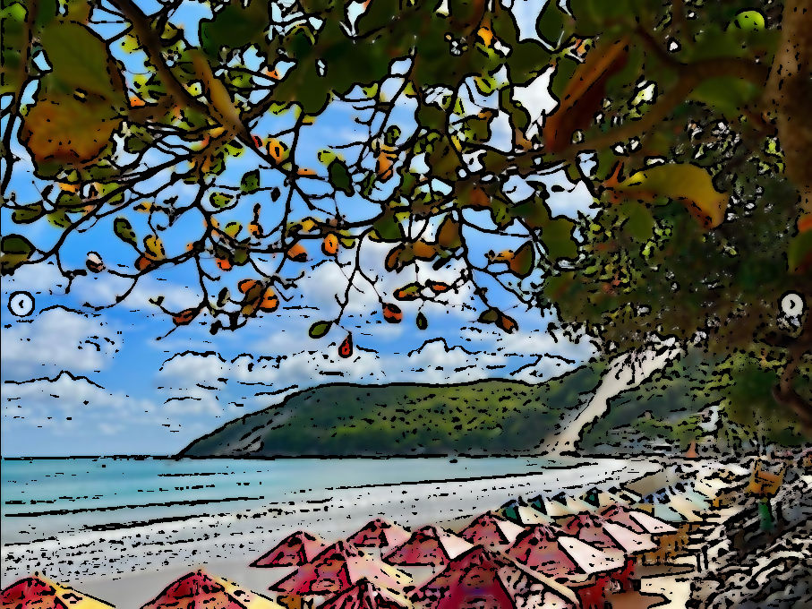

# Tarefa_3_Unidade_PDI
Tarefa da 3° unidade de PDI 
<html lang="pr-br">
<head>
</head>
<body>

Aluno: Lucas da Cunha Lima Vale

<h2>Atividade da unidade 3 - Filtros para fotos</h2>
Imagem utilizada em todos os filtros: 
 
<h3>1.1 - Apenas uma faixa de cor </h3>
Código Utilizado: 
<pre class="prettyprint">
<code>
import cv2
import numpy as np
img = cv2.imread("morro.png")
hsv = cv2.cvtColor(img, cv2.COLOR_BGR2HSV) ##Para conseguirmos isolar uma faixa de cor precisamos mudar de BGR para HSV para facilitar a operação

##Criamos as faixas de cor que utilizariamos na marcara, indicando o limite inferior e o superior da faixa de cor.
lower_blue = np.array([85, 0, 0]) 
upper_blue = np.array([150, 255, 255])

##Criamos as faixas de cor que utilizariamos na marcara, indicando o limite inferior e o superior da faixa de cor.
lower_red = np.array([160,00,0])
upper_red = np.array([200,255,255])

##Criamos as faixas de cor que utilizariamos na marcara, indicando o limite inferior e o superior da faixa de cor.
lower_green = np.array([30,0,0])
upper_green = np.array([85,255,255])

#Fazemos a mascara para ter apenas a cor que queremos e a mascara invertida para conseguirmos ter o background em preto e branco.
mask_red = cv2.inRange(hsv, lower_red, upper_red)
mask_red_inv = cv2.bitwise_not(mask_red)

##Aqui é onde obtemos o nosso resultado
res_red = cv2.bitwise_and(img, img, mask = mask_red)
background_red = cv2.bitwise_and(img_gray, img_gray, mask = mask_red_inv)
background_red = np.stack((background_red,)*3, axis=-1)
red = cv2.add(res_red, background_red)
cv2.imshow('mask', mask_red)
cv2.imshow('result', res_red)
cv2.imshow('red', red)
cv2.waitKey(0)
cv2.destroyAllWindows()

##Fazemos a mascara para ter apenas a cor que queremos e a mascara invertida para conseguirmos ter o background em preto e branco.
mask_blue = cv2.inRange(hsv, lower_blue, upper_blue)
mask_blue_inv = cv2.bitwise_not(mask_blue)

##Aqui é onde obtemos o nosso resultado
res_blue = cv2.bitwise_and(img, img, mask = mask_blue)
background_blue = cv2.bitwise_and(img_gray, img_gray, mask = mask_blue_inv)
background_blue = np.stack((background_blue,)*3, axis=-1)
blue = cv2.add(res_blue, background_blue)
cv2.imshow('mask', mask_blue)
cv2.imshow('result', res_blue)
cv2.imshow('blue', blue)
cv2.waitKey(0)
cv2.destroyAllWindows()

##Fazemos a mascara para ter apenas a cor que queremos e a mascara invertida para conseguirmos ter o background em preto e branco.
mask_green = cv2.inRange(hsv, lower_green, upper_green)
mask_green_inv = cv2.bitwise_not(mask_green)

##Aqui é onde obtemos o nosso resultado
res_green = cv2.bitwise_and(img, img, mask = mask_green)
background_green = cv2.bitwise_and(img_gray, img_gray, mask = mask_green_inv)
background_green = np.stack((background_green,)*3, axis=-1)
green = cv2.add(res_green, background_green)
cv2.imshow('mask', mask_green)
cv2.imshow('result', res_green)
cv2.imshow('verde', green)
cv2.waitKey(0)
cv2.destroyAllWindows()
</code>
Os resultados obtidos foram: 
 
 
 
</pre>

<h3>2. - Cartoon </h3>
Código Utilizado: 
<pre class="prettyprint">
<code>
import cv2
import numpy as np
img = cv2.imread("morro.png")
img_gray = cv2.cvtColor(img, cv2.COLOR_BGR2GRAY)##Obter a imagem em tons de cinza
img_gray_blur = cv2.medianBlur(img_gray, 5)##Obter o cinza suavizado
edges = cv2.adaptiveThreshold(img_gray_blur, 255, cv2.ADAPTIVE_THRESH_MEAN_C, cv2.THRESH_BINARY, 9, 9)##obter as bordas do cinza suavizado
color = cv2.bilateralFilter(img, 9, 250, 250)##Tiramos o ruido sem atrapalhar as bordas
cartoon = cv2.bitwise_and(color, color, mask=edges)
</code>
Os resultados obtidos foram: 
 
</pre>

</body>
</html>
